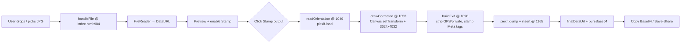

# meta-gyro-tilt — Format Press

> **Ray-Ban Meta frame converter — 100% local, single-file, no backend.**
> **Gyro-tilt corrected • Instagram Story-ready POV**

Converts any JPG/JPEG to the **3024 × 4032 px, 95% JPEG** portrait format used by Ray-Ban Meta capture — corrects EXIF gyro/tilt orientation, resizes, strips private GPS/metadata, and stamps device tags — entirely in your browser.

**Bonus:** the output is the perfect `3:4` portrait for a **cool Instagram Story with that authentic Ray-Ban Meta glasses POV** — gyro-corrected, full-screen, no black bars. Shoot → Stamp → Share to Stories.

---

> ### ⚠️ Disclaimer — For Testing Purposes Only
>
> This project is for **testing / educational purposes only**. It is **not affiliated with, endorsed by, or sponsored by Meta Platforms, Inc., Ray-Ban, EssilorLuxottica, or any of their affiliates**. We **do not represent Meta** and are **not trying to impersonate** Meta, Ray-Ban Meta, or any of their products/brands.
>
> “Meta”, “Ray-Ban Meta”, “Ray-Ban” and related names/marks are trademarks of their respective owners. This is an unofficial, experimental tool with no connection to Meta. All processing is local — no image leaves your device.

---

## Table of Contents

- [Why this exists](#why-this-exists)
- [Features](#features)
- [Use Cases — Instagram Story POV](#use-cases--instagram-story-gyro-tilt-pov)
- [Live Preview](#live-preview)
- [How it works — End-to-End](#how-it-works--end-to-end)
- [Project Structure](#project-structure)
- [Tech Stack](#tech-stack)
- [Getting Started](#getting-started)
- [Usage Guide](#usage-guide)
- [Code Walkthrough](#code-walkthrough)
- [Privacy & Security](#privacy--security)
- [Design System](#design-system)
- [Browser Support](#browser-support)
- [Limitations](#limitations)
- [Roadmap](#roadmap)
- [Trademark & License](#trademark--license)

---

## Why this exists

Photos from phones/cameras carry inconsistent `EXIF Orientation` values (1–8), variable dimensions, and sensitive GPS/lens data. Ray-Ban Meta expects a normalized frame: portrait `3024×4032`, Orientation `1` (top-left), sRGB, with specific `Make/Model` tags and **no GPS**.

`meta-gyro-tilt` (Format Press) solves that as a **zero-dependency, offline-first lab tool**:

*   No upload, no server, no build step — open `index.html` and it works.
*   Deterministic output for testing pipelines that need a "Meta-like" JPEG + Base64.
*   Teaches EXIF + Canvas orientation math without hiding it behind a library.

The name `meta-gyro-tilt` nods to the gyro/orientation correction at its core.

## Features

| Area | What it does |
| :--- | :--- |
| **Input** | Drag & drop, click-to-browse, dedicated **Use camera** (`capture="environment"`) + **Photo library** buttons. Validates `image/jpeg` + `.jpg/.jpeg` extension (`index.html:984-987`). |
| **Preview** | Real-time preview via `FileReader.readAsDataURL` → `preview.src`. Shows filename + size (`formatBytes()` at `index.html:978-982`). |
| **Orientation fix (gyro-tilt)** | Reads EXIF `Orientation` with `piexif.load` (`index.html:1049-1056`), then applies correct `CanvasRenderingContext2D.setTransform()` for all 8 orientations (`index.html:1072-1081`) and draws to `3024×4032` at 95% quality (`index.html:1083`). Result: horizon-straight POV even if you shot tilted — perfect for Stories. |
| **EXIF sanitization** | Wipes `GPS` block, removes `Software`, `HostComputer`, `MakerNote`, `LensMake/Model/Spec` (`index.html:1097-1103`), then stamps `Make="Meta AI"`, `Model="Ray-Ban Meta Smart Glasses 2"`, `Orientation=1`, `ColorSpace=1`, `PixelXDimension=3024`, `PixelYDimension=4032` (`index.html:1104-1110`). |
| **Export** | Re-injects EXIF via `piexif.dump` + `piexif.insert` (`index.html:1165-1166`), exposes `data:` URL + **pure Base64** (`split(",")[1]` at `index.html:1167`). Copy via `navigator.clipboard.writeText` with `execCommand` fallback (`index.html:1122-1136`). Save via Web Share API (`navigator.canShare`/`navigator.share`) with native **Share to Instagram Stories** support + download fallback (`index.html:1138-1160`). |
| **UX** | 3-step workflow sidebar (`Load source → Inspect frame → Stamp output`, `index.html:767-774`), sticky output panel, live specs (dimensions/format/orientation/private EXIF/size/Base64), keyboard-accessible dropzone (`tabindex="0"` + Enter/Space, `index.html:890-895`). New `intro-badge` at `index.html:272-291` highlights *Gyro-tilt POV — Instagram Story ready*. |
| **Privacy** | Everything in-memory. No network after initial CDN load. See [Privacy](#privacy--security). |

## Use Cases — Instagram Story (Gyro-Tilt POV)

### The coolest trick: fake it till you make it — Ray-Ban Meta Stories without the glasses

`3024 × 4032` is a **3:4 portrait** — Instagram Stories are `1080 × 1920` (9:16). Our output fills the Story frame edge-to-edge when you post it (Instagram auto-fits), giving you that immersive, slightly-tilted **glasses POV** people recognize from Ray-Ban Meta Stories.

| What you get | Why it looks cool on Stories |
| :--- | :--- |
| **Gyro-tilt correction** (`index.html:1058-1088`) fixes the horizon no matter how you held the phone — like Meta's own stabilization | No more sideways Story when you tilted your head |
| **Exact portrait 3024×4032 @ 95%** (`index.html:1083`) | Crisp on Stories, no Instagram re-compression weirdness, no letterbox bars |
| **EXIF stamped as `Meta AI / Ray-Ban Meta Smart Glasses 2`** (`index.html:1104-1105`) | For testing pipelines/tools that read `Make/Model` — and for the fun flex |
| **GPS/private data wiped** (`index.html:1097-1103`) | Post publicly without leaking location |

**Workflow for Instagram:**

1.  Pick any JPG (phone photo, DSLR, even screenshot) → **Stamp output**.
2.  Tap **Save / share** → on iOS/Android the native share sheet opens (`index.html:1138-1151`). Choose **Instagram → Stories**.
3.  Or **Copy Base64** and paste into a testing pipeline, then save from there.

> Tip: shoot *slightly* tilted / head-level for the most authentic POV. The Canvas `setTransform` math (`index.html:1072-1081`) will upright it but keep the natural POV feel — that's the “gyro-tilt” magic.

Other uses: testing Meta AI ingest, QA for image APIs that validate `PixelXDimension/PixelYDimension` + `Model`, teaching EXIF, or just flexing a clean Story when you left the glasses at home.

---

## Live Preview

Single file: `index.html` (~1230 lines, HTML+CSS+JS). No `npm install`, no bundler.

```
meta-gyro-tilt/
├── index.html   # app, styles, logic
└── README.md    # you are here
```

Open the file directly — it also works via any static host (`python -m http.server`, `npx serve`, GitHub Pages, etc.).

## How it works — End-to-End



### 1. Input handling `index.html:931-1020`

*   **Three entry points** map to two hidden inputs:
    *   `fileInput` (`accept="image/jpeg,.jpg,.jpeg"` at `index.html:840`) — library.
    *   `cameraInput` (same + `capture="environment"` at `index.html:841`) — opens camera on mobile.
*   Helpers `openLibrary()` / `openCamera()` at `index.html:931-932` trigger `.click()`.
*   Dropzone `index.html:807` handles `dragenter/dragover/dragleave/drop` (`index.html:952-967`) and click/keydown.
*   `handleFile(file)` validates MIME + extension, then `FileReader.readAsDataURL` loads the image as `sourceDataUrl`. It resets state (`finalDataUrl`, `pureBase64`), shows `previewWrap`, updates `fileName`/`fileMeta` with `formatBytes()`, enables `convertBtn`, and sets workflow to `loaded` (`setStepState`, `index.html:1022-1035`).

### 2. Orientation reading `index.html:1049-1056`

```js
function readOrientation(dataUrl) {
  try { return piexif.load(dataUrl)["0th"][piexif.ImageIFD.Orientation] || 1 }
  catch { return 1 }
}
```

*   `piexifjs@1.0.6` (CDN at `index.html:12`) parses JPEG APP1/EXIF.
*   Falls back to `1` (normal) if no EXIF or parse fails.

### 3. Canvas correction `index.html:1058-1088`

`drawCorrected(dataUrl, 3024, 4032, orientation)`:

1.  Creates `Image`, sets `src = dataUrl`.
2.  Creates `<canvas>` sized `targetW × targetH`, swapped if `orientation` 5–8 (90°/270° rotated cases).
3.  Applies `ctx.setTransform(a,b,c,d,e,f)` per EXIF spec:
    *   `1` = identity, `2` = flip H, `3` = 180°, `4` = flip V, `5` = transpose, `6` = 90° CW, `7` = transverse, `8` = 270° CW.
4.  `ctx.drawImage(image, 0, 0, 3024, 4032)` scales/crops to target.
5.  Exports `canvas.toDataURL("image/jpeg", 0.95)`.

This is the "gyro-tilt" — you get an upright `3024×4032` regardless of how the phone was held.

### 4. EXIF rebuilding `index.html:1090-1111`

`buildExif(dataUrl)`:

*   Loads existing EXIF or creates empty `{ "0th": {}, "Exif": {}, "GPS": {}, "1st": {}, thumbnail: null }`.
*   **Strips**: `GPS = {}` (entire block), `Software`, `HostComputer`, `MakerNote`, `LensMake`, `LensModel`, `LensSpecification`.
*   **Stamps**:

    | Tag | Value |
    | :--- | :--- |
    | `0th.Make` | `Meta AI` |
    | `0th.Model` | `Ray-Ban Meta Smart Glasses 2` |
    | `0th.Orientation` | `1` (normalized) |
    | `Exif.ColorSpace` | `1` (sRGB) |
    | `Exif.PixelXDimension` | `3024` |
    | `Exif.PixelYDimension` | `4032` |

### 5. Stamping & export `index.html:1162-1169` + `1113-1160`

```js
async function convertImage() {
  const orientation = readOrientation(sourceDataUrl);
  const corrected = await drawCorrected(sourceDataUrl, 3024, 4032, orientation);
  const exifBytes = piexif.dump(buildExif(sourceDataUrl));
  finalDataUrl = piexif.insert(exifBytes, corrected);
  pureBase64 = finalDataUrl.split(",")[1];
}
```

*   `finalDataUrl` is a full `data:image/jpeg;base64,...` ready for ``.
*   `pureBase64` is the same without the prefix — what APIs often expect.
*   `dataUrlToBlob()` (`index.html:1113-1120`) decodes base64 → `Uint8Array` → `Blob`.
*   **Copy**: `copyText()` (`index.html:1122-1136`) prefers `navigator.clipboard.writeText`, falls back to hidden `textarea` + `document.execCommand("copy")`.
*   **Save/Share**: `saveOrShareImage()` (`index.html:1138-1160`) tries `navigator.canShare({files})` → `navigator.share({files})`; on cancel/unsupported it creates an `ObjectURL` and triggers `<a download="meta-glasses-converted.jpg">`.

Output specs update in the right panel (`index.html:859-866`, refreshed at `index.html:1187-1191`): Orientation `Already correct` vs `Corrected`, Private EXIF `Clean + stamped`, Size via `dataUrlToBlob(finalDataUrl).size`, Base64 `Available`.

## Project Structure

```
meta-gyro-tilt/
├── index.html   # All-in-one: <style> design system + <script> app logic
└── README.md
```

No `package.json`, no `node_modules`, no build. The app is intentionally a single file for auditability and portability.

## Tech Stack

*   **HTML5 + CSS3**: custom design system (see [Design System](#design-system)), no framework.
*   **Vanilla JS (ES2020)**: `FileReader`, `Canvas 2D`, `Blob`/`File`/`URL.createObjectURL`, Web Share, Clipboard.
*   **piexifjs 1.0.6** via cdnjs (`index.html:12`): EXIF read/dump/insert. Only external dep.
*   **Fonts**: `Bebas Neue` (display) + `Barlow` (body) via Google Fonts (`index.html:11`).

## Getting Started

### Option 1 — Double-click

Just open `index.html` in Chrome/Firefox/Safari/Edge. No server needed (except some browsers block `file://` clipboard/share — see below).

### Option 2 — Local server (recommended)

```bash
# Python
python3 -m http.server 8000
# then open http://localhost:8000/

# Node
npx serve .
# or
npx http-server -p 8000
```

### CDN note

First load fetches `piexifjs` and Google Fonts from CDN. After that, image processing is offline. For fully offline, self-host `piexif.js` and replace the `<script>`/`<link>` tags.

## Usage Guide

1.  **Load source** (sidebar `01`, `index.html:769`):
    *   Drag a JPG onto the dashed zone, or click **browse your photo library** (`index.html:813`), **Change** (`index.html:826`), **Photo library** (`index.html:784-787`), or **Use camera** (`index.html:780-783`).
    *   Only `JPG/JPEG` passes validation — others show `Please choose a JPG or JPEG image.` (`index.html:985-986`).
2.  **Inspect frame** (sidebar `02`): preview appears (`previewWrap.visible`, `index.html:999-1000`), filename/size shown, `Stamp output` enables. Notice the **Gyro-tilt POV — Instagram Story ready** badge (`index.html:818-825`) — that's your hint the output is Story-optimized.
3.  **Stamp output** (sidebar `03`, button `index.html:869-872`): click **Stamp output**. While working it shows `Normalizing orientation…` with spinner (`index.html:1122`, `showStatus` at `index.html:1037-1042`). On success: preview updates to converted image, output panel gets `ready` state (`index.html:1128-1131`), specs refresh, workflow moves to `stamped`.
4.  **Export**:
    *   **Copy Base64** (`index.html:873-876`) → copies pure base64 to clipboard (`Copied` status).
    *   **Save / share** (`index.html:877-880`) → triggers native share sheet on mobile/desktop supporting Web Share, otherwise downloads `meta-glasses-converted.jpg`.
    *   **→ Instagram Story**: on iOS/Android, the share sheet lists **Instagram → Story**. Pick it — your `3024×4032` fills the Story frame (Instagram scales `3:4` to `9:16` with no bars). Add stickers/text in Instagram as usual. For desktop, download then AirDrop/transfer to phone.

Keyboard: dropzone is `role="button"` + `tabindex="0"` — focus and press `Enter`/`Space` to open picker. All buttons have `focus-visible` outline (`index.html:55-58`).

## Code Walkthrough

| Function | Location | Purpose |
| :--- | :--- | :--- |
| `formatBytes()` | `index.html:978-982` | Human-readable file size |
| `handleFile(file)` | `index.html:984-1020` | Validate, read, preview, reset output state |
| `setStepState(state)` | `index.html:1022-1035` | Toggle `active`/`done` on workflow steps |
| `showStatus(msg,type,loading)` | `index.html:1037-1042` | Status bar (success/error/loading + spinner) |
| `readOrientation(dataUrl)` | `index.html:1049-1056` | EXIF orientation → 1–8 |
| `drawCorrected(...)` | `index.html:1058-1088` | Canvas transform + resize → JPEG DataURL |
| `buildExif(dataUrl)` | `index.html:1090-1111` | Strip private tags, stamp Meta tags |
| `dataUrlToBlob(dataUrl)` | `index.html:1113-1120` | Base64 → Blob for size/share |
| `copyText(text)` | `index.html:1122-1136` | Clipboard with fallback |
| `saveOrShareImage(dataUrl)` | `index.html:1138-1160` | Web Share → download fallback |
| `convertImage()` | `index.html:1162-1169` | Orchestrates above 3 steps |

State lives in 4 module globals at `index.html:926-929`: `sourceDataUrl`, `finalDataUrl`, `pureBase64`, `sourceFile`.

## Privacy & Security

*   **Local-only**: `FileReader` + `Canvas` + `piexif` all run in-memory. No `fetch`/`XHR` sends image data anywhere. Verified — search `index.html` for `fetch` → no matches.
*   **GPS stripped**: `exif.GPS = {}` guarantees no lat/long leaks into output.
*   **Private tags removed**: see table in [Step 4](#4-exif-rebuilding-indexhtml1090-1111).
*   **No storage**: no `localStorage`/`IndexedDB`; refresh clears state.
*   **CDN risk**: only external load is `piexifjs` + Google Fonts. For air-gapped use, vendor them.

## Design System

Defined at `index.html:14-34`:

*   **Palette**: `coal-950 #111110` → `coal-750 #2b2b28`, `bone #f1efe7` / `bone-muted #8e8c84`, `ember #ef6b3d` (accent), `green #7cbe8b` (success), `red #f0786b` (error).
*   **Type**: `Bebas Neue` for display (`--display`), `Barlow` for body (`--body`).
*   **Layout**: `app-shell` grid `224px + 1fr` (`index.html:72-80`), collapses to single column at `900px`/`640px` (`index.html:703-751`).
*   **Components**: `.disclaimer-footer` (`index.html:676-690`), `.dropzone` (dashed → solid + ember on drag/hover), `.panel`, `.button.primary` (ember) / `.secondary` (coal), `.intro-badge` (`index.html:272-291`).

## Browser Support

*   Modern evergreen: Chrome/Edge 90+, Firefox 90+, Safari 15+.
*   Requires: `Canvas 2D`, `FileReader.readAsDataURL`, `atob`/`Blob`. All baseline.
*   Optional (gracefully degraded): `navigator.clipboard.writeText` (falls back to `execCommand`), `navigator.canShare`/`navigator.share` (falls back to download), `capture="environment"` (ignored on desktop).

## Limitations

*   **JPEG only** — PNG/WebP/HEIC rejected by design (Meta pipeline is JPEG).
*   **No crop control** — image is stretched to exactly `3024×4032` via `drawImage(image,0,0,3024,4032)`; no letterboxing or smart crop.
*   **One image at a time** — no batch.
*   **EXIF subset** — only the tags listed above are handled; other APP segments (ICC, XMP) are discarded on re-encode.
*   **Memory**: large JPEGs are held as base64 strings + canvas bitmaps — very large files (e.g., 50 MP) may hit browser memory limits.

## Roadmap

*   [ ] Optional letterbox vs stretch toggle
*   [ ] Batch queue + ZIP export
*   [ ] Self-hosted `piexifjs` + no-CDN mode
*   [ ] PWA wrapper for offline install
*   [ ] Preserve ICC profile option

## Trademark & License

All product names, logos, and brands are property of their respective owners. Use does not imply endorsement.

This repo is released for **testing / demonstration only** — no warranty. Do not use to impersonate Meta or any brand, or to misrepresent device provenance. You are responsible for how you tag and share images.

---

**Made for testing. Not affiliated with Meta.** If you need a production Meta integration, use the official Meta SDKs/docs.
